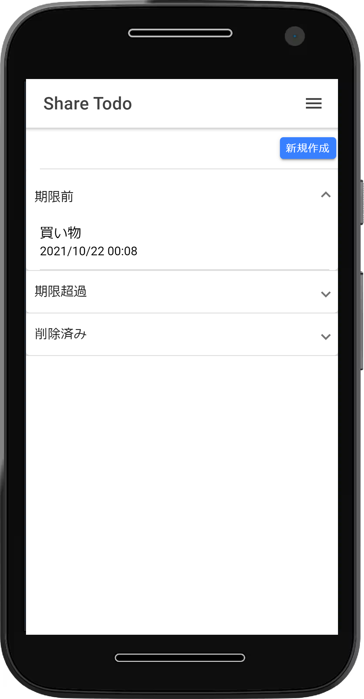
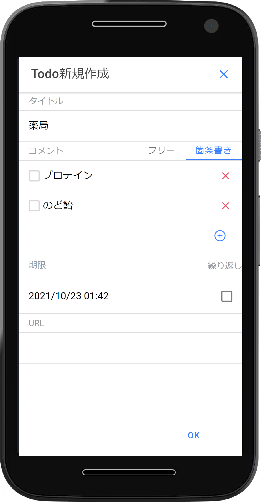

# share-todo

アカウント間での Todo の共有を目的としたシステムです。<br>
下記の機能を利用して構築しています。<br>
Amazon Cognito：認証<br>
Amazon DynamoDB：データ保持<br>
Ionic/Angular：フロントエンド・ハイブリッドアプリ

## DEMO

| TodoList 画面                                                  | Todo 新規作成画面                                                    |
| -------------------------------------------------------------- | -------------------------------------------------------------------- |
|  |  |

## Installation

1. Amplify CLI のインストール

```shell
npm install -g @aws-amplify/cli
```

2. [AWS Amplify の設定](https://qiita.com/reriiasu/items/0d3affe022a9f8c5c296#aws-amplify%E3%81%AE%E8%A8%AD%E5%AE%9A)※外部リンク(Qiita)

3. [AWS Amplify 初期化](https://qiita.com/reriiasu/items/0d3affe022a9f8c5c296#aws-amplify-%E5%88%9D%E6%9C%9F%E5%8C%96)※外部リンク(Qiita)

4. 認証機能・API の追加

```shell
$ amplify add auth
## Amazon Cognito. を利用する。
$ amplify add api
## graphqlを選択する。
```

下記ファイルが修正された場合は元に戻す。<br>
amplify\backend\api\sharetodo\schema.graphql

5. AWS への Push

```shell
$ amplify push
```
